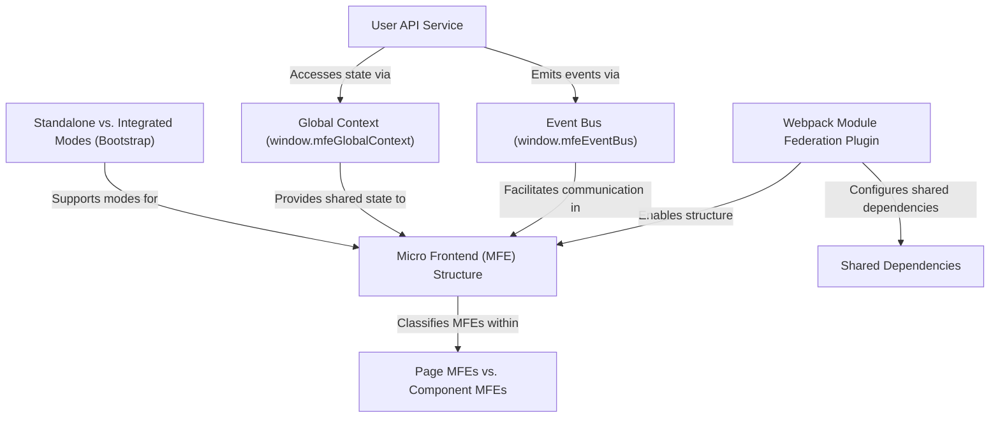

# Tutorial: mfe-project

This project is built using a **Micro Frontend (MFE)** architecture, splitting a web application into **independent mini-apps** (MFEs) like a Header, Products page, and Orders page. A main **Shell** application acts as the container, dynamically loading these MFEs. The core technology is **Webpack Module Federation**, which allows MFEs to _share code and expose components_, enabling them to run together seamlessly while still being _developed and deployed separately_. Communication and shared data between MFEs are handled via a global _event bus_ and _context_.

## Chapters

1. [Micro Frontend (MFE) Structure
   ](01_micro_frontend__mfe__structure_.md)
2. [Webpack Module Federation Plugin
   ](02_webpack_module_federation_plugin_.md)
3. [Shared Dependencies
   ](03_shared_dependencies_.md)
4. [Standalone vs. Integrated Modes (Bootstrap)
   ](04_standalone_vs__integrated_modes__bootstrap__.md)
5. [Page MFEs vs. Component MFEs
   ](05_page_mfes_vs__component_mfes_.md)
6. [Event Bus (window.mfeEventBus)
   ](06_event_bus__window_mfeeventbus__.md)
7. [Global Context (window.mfeGlobalContext)
   ](07_global_context__window_mfeglobalcontext__.md)
8. [User API Service
   ](08_user_api_service_.md)
